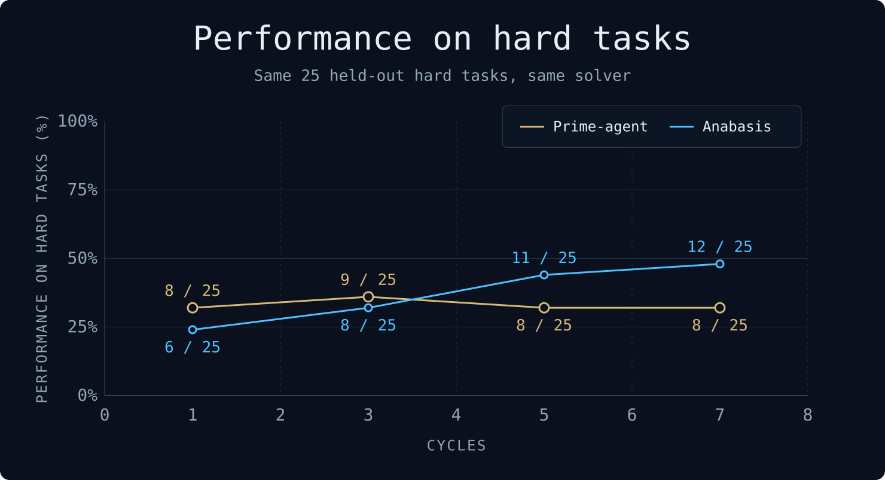

**I managed to automate myself.**

Introducing **Anabasis**, a system that builds an agent harness and its evaluation from a simple prompt for a Hard-to-Verify domain.

It researches the domain, builds tools and checks, and uses recorded results to guide further changes.

## What it builds

Name the domain and what you want the agent to do, with optional public context, and Anabasis works towards a tested harness for that request.
That includes researching the domain, setting up toolchains, writing domain-specific tools and defining how submissions should be checked.

| Component | What does it contain? |
| --- | --- |
| **Built Harness** | A runtime, toolkit and operating guide that a separate agent uses to solve and submit tasks in the domain |
| **Correctness Model** | Task families, test cases, known-correct and deliberately incorrect examples that test the evaluation, and executable checks |
| **Run evidence** | Recorded attempts, task outcomes, model/tool traces, difficulty changes and promotion decisions |
| **Exportable bundle** | The Harness and its evaluation, with separate commands to solve tasks and check outputs |

## How it works

```text
PROMPT + CONTEXT → BUILD → MEASURE → LEARN → CLIMB or REBUILD or STOP
```

_Build_: The Builder starts from a minimal Pi-inspired Starter Pack, researches the domain, sets up the required tooling and produces the first working Harness.

_Validate_: Before measurement, the candidate must pass a predefined validation suite, including known-good and deliberately incorrect examples, plus a reference-solver check across the task set.

_Measure_ & _Iterate_: The Built Harness solves the tasks, a Verifier checks its submissions and several Reviewers, inspired by the latest research, identify potential improvements. The results inform further changes to the Harness or its evaluation, attempts at harder tasks, or a decision to stop.

## Results



After 7 cycles, **Prime-agent** solves 8 of the 25 held-out hard tasks correctly, while **Anabasis** solves 12.
Both use Claude Opus 5 at medium thinking and the same verifier; Anabasis is slower at 120 minutes per task and Prime-agent 45, however a lot of time is spent in CPU cycles using the real solver it built. The Anabasis count at cycle 7 includes one task passed on a re-solve with the submit time-left reply.

## Run it

We use **Bun 1.4.2** (Stable) and support macOS or Linux. Both need `ripgrep`, which the Builder searches with; Linux also needs `bubblewrap`.
So first, if you haven’t already, please install Bun:
```sh
curl -fsSL https://bun.com/install | bash -s "bun-v1.4.2"
```
This example uses Claude for all three model roles.

```sh
git clone https://github.com/s-smits/anabasis.git
cd anabasis
bun install --frozen-lockfile
bun run login -- claude

bun run fullrun -- \
  --prompt "Build a harness that writes ESP32 firmware for sensor and peripheral tasks." \
  --provider-turn-budget 1320 \
  --builder-backend claude \
  --built-backend claude \
  --review-backend claude
```

`--provider-turn-budget` is required: it caps the provider turns the whole run may spend.
The run prints `created project <id>`; add `--project <id>` to continue that project, or `--context ./context/public-notes.md` for supporting material.
Builder, Built Harness and Review can each use Claude, Codex or OpenRouter, with their own model configuration.
For Claude, `CLAUDE_CODE_OAUTH_TOKEN` (process environment or `.env`; `bun run login -- claude` stores one) serves all three roles at once.

<details>
<summary>Optional destructive-command guard</summary>

An installed `dcg` adds command-shape checks on the Claude and Pi shell paths; it is not a complete security boundary and is not installed automatically.
On macOS, install it with:

```sh
brew install dicklesworthstone/tap/dcg && dcg install
```

The [guard implementation](src/builder/command-guard.ts) records its scope and limitations.

</details>

## Take the Harness along

An adopted Harness exports as a directory that solves and checks tasks without the campaign that built it.
Export from the checkout that ran it: `your-project-id` is the id the run printed, and a path to any directory with `agent/` and `correctness-model/` works as well.

```sh
bun run harness -- export your-project-id ./my-harness
cd my-harness
bun install --frozen-lockfile
```

Give the Built Harness its condition and credential in `my-harness/.env` or the process environment:

```sh
HARNESS_BUILT_BACKEND=claude
CLAUDE_BUILT_MODEL=claude-opus-5
CLAUDE_BUILT_REASONING_EFFORT=medium
CLAUDE_CODE_OAUTH_TOKEN=<token from claude setup-token>
```

Then solve a task and check the answer:

```sh
bun run solve -- task-id ./output
bun run check -- task-id ./output/cases/task-id/artifact.json
```

- **Tasks.** A task is a `taskId` from `correctness-model/tasks.json`, or a JSON file with `taskId`, `family` and `publicInput`. A file inherits the recorded hidden expectations only when all three match; checking a new or changed task needs its own `hidden` array, and an empty one runs only the public checks.
- **Solve** runs the agent once, confined, prints the case as JSON and exits 0 when a submit was accepted. The artifact goes to `<out-dir>/cases/<taskId>/artifact.json`; the default out-dir is `runs-local/<timestamp>`. The solve never reads `correctness-model/`, and its shell cannot read the export.
- **Check** runs the Correctness Model, prints the public verdict (`truthOk`, `pass`, a non-result kind, failed check ids, the digest of every tool that ran) and exits 0 on a pass. The artifact must pass the submission schema a solve's submit does. The full verdict, with the issue text and the reason for a non-result such as a missing tool, goes to the printed `evidencePath`: `<out-dir>/<taskId>-verdict.json`, by default in `checks-local/`. It is a local evaluation, not a capability claim.
- **Models and credentials.** Pin the model so the printed `builtModel` is the condition you meant. Claude takes `CLAUDE_CODE_OAUTH_TOKEN` or `ANTHROPIC_API_KEY`. Codex reads `CODEX_BUILT_MODEL`, `CODEX_BUILT_REASONING_EFFORT` and its login under `CODEX_HOME`; OpenRouter reads `OPENROUTER_MODEL`, `OPENROUTER_BUILT_REASONING_EFFORT` and `OPENROUTER_API_KEY`. Credentials never enter the export.
- **Host.** Bun 1.4.2 and the wall a run uses: Seatbelt on macOS, `bubblewrap` on Linux. Without the wall a case is a typed non-result, never an unconfined run.
- **Tools.** `.toolchain/` holds the tools the Builder installed, built for the operating system and architecture that installed them, and is copied in full: an ESP32 export is about 11 GB. The export's README header names the tools its checks run. A link in it to a host file, or to nothing, is left out and named at the top of the export's README; such a tool resolves from the host `PATH`.
- **Code.** The export runs this checkout's solve and verifier code over the adopted bundle: a fresh solve, not a replay of the measured run.

The [export](src/run/bundle-export.ts) copies this section into `my-harness/README.md`.

## Contributing

`bun run hooks:install` turns on the repository's commit and push hooks: the commit hook checks
format and lint on the staged files and scans them for secrets, and the push hook runs `bun run gate`.
The two lint plugins, `anti-slop` (copied from dmmulroy/anti-slop) and the repository's own `ana`
simplify catchers, are optional: their findings are counted on every run and fail only
`bun run lint -- --strict` or a run with `ANA_LINT_STRICT=1` in the environment.

## Licence

MIT; see [LICENSE](LICENSE). Code copied or ported from other projects keeps its notices in
[THIRD_PARTY_NOTICES.md](THIRD_PARTY_NOTICES.md).
